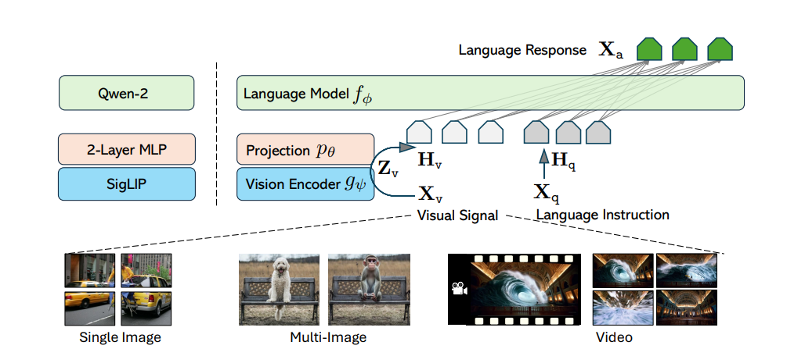

---
language:
- en
- zh
license: apache-2.0
tags:
- vision
- image-text-to-text
- transformers.js
datasets:
- lmms-lab/LLaVA-OneVision-Data
pipeline_tag: image-text-to-text
arxiv: 2408.03326
library_name: transformers
---
# LLaVA-Onevision Model Card



Check out also the Google Colab demo to run Llava on a free-tier Google Colab instance: [](https://colab.research.google.com/drive/1-4AtYjR8UMtCALV0AswU1kiNkWCLTALT?usp=sharing)

Below is the model card of 0.5B LLaVA-Onevision model which is copied from the original LLaVA-Onevision model card that you can find [here](https://huggingface.co/lmms-lab/llava-onevision-qwen2-0.5b-si).


## Model details

**Model type:**
LLaVA-Onevision is an open-source multimodal LLM trained by fine-tuning Qwen2 on GPT-generated multimodal instruction-following data.
LLaVA-OneVision is the first single model that can simultaneously push the performance boundaries of open LMMs in three important computer
vision scenarios: single-image, multi-image, and video scenarios. Importantly, the design of LLaVA-OneVision allows strong transfer learning
across different modalities/scenarios, yielding new emerging capabilities. In particular, strong video understanding and cross-scenario
capabilities are demonstrated through task transfer from images to videos.

**Model date:**
LLaVA-Onevision-0.5-ov was added in August 2024.

**Paper or resources for more information:**
https://llava-vl.github.io/

- **Architecture:** SO400M + Qwen2
- **Pretraining Stage:** LCS-558K, 1 epoch, projector
- **Mid Stage:** A mixture of 4.7M high-quality synthetic data, 1 epoch, full model
- **Final-Image Stage:** A mixture of 3.6M single-image data, 1 epoch, full model
- **OneVision Stage:** A mixture of 1.6M single-image/multi-image/video data, 1 epoch, full model
- **Precision:** bfloat16


## How to use the model

First, make sure to have `transformers` installed from [branch](https://github.com/huggingface/transformers/pull/32673) or `transformers >= 4.45.0`. 
The model supports multi-image and multi-prompt generation. Meaning that you can pass multiple images in your prompt. Make sure also to follow the correct prompt template by applying chat template:

### Using `pipeline`:

Below we used [`"llava-hf/llava-onevision-qwen2-0.5b-ov-hf"`](https://huggingface.co/llava-hf/llava-onevision-qwen2-0.5b-ov-hf) checkpoint.

```python
from transformers import pipeline

pipe = pipeline("image-text-to-text", model="llava-onevision-qwen2-0.5b-ov-hf")
messages = [
    {
      "role": "user",
      "content": [
          {"type": "image", "url": "https://huggingface.co/datasets/huggingface/documentation-images/resolve/main/transformers/tasks/ai2d-demo.jpg"},
          {"type": "text", "text": "What does the label 15 represent? (1) lava (2) core (3) tunnel (4) ash cloud"},
        ],
    },
]

out = pipe(text=messages, max_new_tokens=20)
print(out)
>>> [{'input_text': [{'role': 'user', 'content': [{'type': 'image', 'url': 'https://huggingface.co/datasets/huggingface/documentation-images/resolve/main/transformers/tasks/ai2d-demo.jpg'}, {'type': 'text', 'text': 'What does the label 15 represent? (1) lava (2) core (3) tunnel (4) ash cloud'}]}], 'generated_text': 'Lava'}]
```


### Using pure `transformers`:

Below is an example script to run generation in `float16` precision on a GPU device:

```python
import requests
from PIL import Image

import torch
from transformers import AutoProcessor, LlavaOnevisionForConditionalGeneration

model_id = "llava-hf/llava-onevision-qwen2-0.5b-ov-hf"
model = LlavaOnevisionForConditionalGeneration.from_pretrained(
    model_id, 
    torch_dtype=torch.float16, 
    low_cpu_mem_usage=True, 
).to(0)

processor = AutoProcessor.from_pretrained(model_id)

# Define a chat history and use `apply_chat_template` to get correctly formatted prompt
# Each value in "content" has to be a list of dicts with types ("text", "image") 
conversation = [
    {

      "role": "user",
      "content": [
          {"type": "text", "text": "What are these?"},
          {"type": "image"},
        ],
    },
]
prompt = processor.apply_chat_template(conversation, add_generation_prompt=True)

image_file = "http://images.cocodataset.org/val2017/000000039769.jpg"
raw_image = Image.open(requests.get(image_file, stream=True).raw)
inputs = processor(images=raw_image, text=prompt, return_tensors='pt').to(0, torch.float16)

output = model.generate(**inputs, max_new_tokens=200, do_sample=False)
print(processor.decode(output[0][2:], skip_special_tokens=True))
```

-----------
From transformers>=v4.48, you can also pass image/video url or local path to the conversation history, and let the chat template handle the rest.
Chat template will load the image for you and return inputs in `torch.Tensor` which you can pass directly to `model.generate()` 

```python
messages = [
    {
        "role": "user",
        "content": [
            {"type": "image", "url": "https://www.ilankelman.org/stopsigns/australia.jpg"}
            {"type": "text", "text": "What is shown in this image?"},
        ],
    },
]

inputs = processor.apply_chat_template(messages, add_generation_prompt=True, tokenize=True, return_dict=True, return_tensors"pt")
output = model.generate(**inputs, max_new_tokens=50)
```

### Model optimization

#### 4-bit quantization through `bitsandbytes` library

First make sure to install `bitsandbytes`, `pip install bitsandbytes` and make sure to have access to a CUDA compatible GPU device. Simply change the snippet above with: 

```diff
model = LlavaOnevisionForConditionalGeneration.from_pretrained(
    model_id, 
    torch_dtype=torch.float16, 
    low_cpu_mem_usage=True,
+   load_in_4bit=True
)
```

#### Use Flash-Attention 2 to further speed-up generation

First make sure to install `flash-attn`. Refer to the [original repository of Flash Attention](https://github.com/Dao-AILab/flash-attention) regarding that package installation. Simply change the snippet above with: 

```diff
model = LlavaOnevisionForConditionalGeneration.from_pretrained(
    model_id, 
    torch_dtype=torch.float16, 
    low_cpu_mem_usage=True,
+   use_flash_attention_2=True
).to(0)
```


### Usage w/ Transformers.js

If you haven't already, you can install the [Transformers.js](https://huggingface.co/docs/transformers.js) JavaScript library from [NPM](https://www.npmjs.com/package/@huggingface/transformers) using:
```bash
npm i @huggingface/transformers
```

**Example:** Multi-round conversations w/ PKV caching
```js
import { AutoProcessor, AutoTokenizer, LlavaOnevisionForConditionalGeneration, RawImage } from '@huggingface/transformers';

// Load tokenizer, processor and model
const model_id = 'llava-hf/llava-onevision-qwen2-0.5b-ov-hf';

const tokenizer = await AutoTokenizer.from_pretrained(model_id);
const processor = await AutoProcessor.from_pretrained(model_id);
const model = await LlavaOnevisionForConditionalGeneration.from_pretrained(model_id, {
    dtype: {
        embed_tokens: 'fp16', // or 'fp32' or 'q8'
        vision_encoder: 'fp16', // or 'fp32' or 'q8'
        decoder_model_merged: 'q4', // or 'q8'
    },
    // device: 'webgpu',
});

// Prepare text inputs
const prompt = 'What does the text say?';
const messages = [
    { role: 'system', content: 'Answer the question.' },
    { role: 'user', content: `<image>\n${prompt}` }
]
const text = tokenizer.apply_chat_template(messages, { tokenize: false, add_generation_prompt: true });
const text_inputs = tokenizer(text);

// Prepare vision inputs
const url = 'https://huggingface.co/qnguyen3/nanoLLaVA/resolve/main/example_1.png';
const image = await RawImage.fromURL(url);
const vision_inputs = await processor(image);

// Generate response
const { past_key_values, sequences } = await model.generate({
    ...text_inputs,
    ...vision_inputs,
    do_sample: false,
    max_new_tokens: 64,
    return_dict_in_generate: true,
});

// Decode output
const answer = tokenizer.decode(
    sequences.slice(0, [text_inputs.input_ids.dims[1], null]),
    { skip_special_tokens: true },
);
console.log(answer);
// The text says "small but mighty" in a playful font.

const new_messages = [
    ...messages,
    { role: 'assistant', content: answer },
    { role: 'user', content: 'How does the text correlate to the context of the image?' }
]
const new_text = tokenizer.apply_chat_template(new_messages, { tokenize: false, add_generation_prompt: true });
const new_text_inputs = tokenizer(new_text);

// Generate another response
const output = await model.generate({
    ...new_text_inputs,
    past_key_values,
    do_sample: false,
    max_new_tokens: 256,
});
const new_answer = tokenizer.decode(
    output.slice(0, [new_text_inputs.input_ids.dims[1], null]),
    { skip_special_tokens: true },
);
console.log(new_answer);
// The text "small but mighty" is likely a playful or humorous reference to the image of the blue mouse with the orange dumbbell. It could be used as a motivational phrase or a playful way to express the idea that even small things can be impressive or powerful.
```

# Citation
```
@misc{li2024llavaonevisioneasyvisualtask,
      title={LLaVA-OneVision: Easy Visual Task Transfer}, 
      author={Bo Li and Yuanhan Zhang and Dong Guo and Renrui Zhang and Feng Li and Hao Zhang and Kaichen Zhang and Yanwei Li and Ziwei Liu and Chunyuan Li},
      year={2024},
      eprint={2408.03326},
      archivePrefix={arXiv},
      primaryClass={cs.CV},
      url={https://arxiv.org/abs/2408.03326}, 
}
```